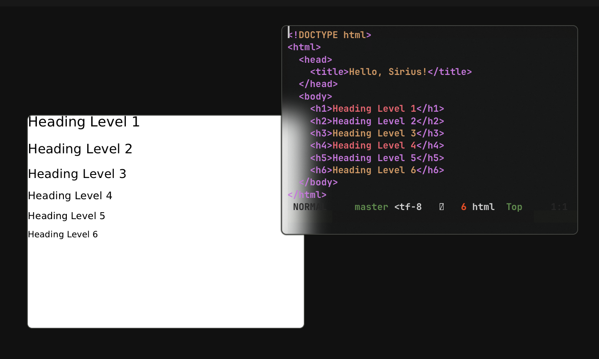
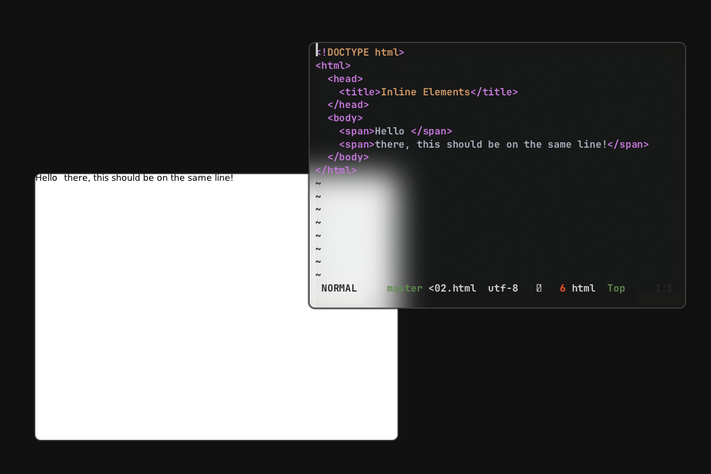

# sirius
Sirius is a tiny HTML5/CSS3 renderer written in Nim. It isn't anything serious right now, but it can render some HTML and apply CSS.

No build instructions are given since it's an experimental project with zero promises. Expect more tomfooleries occurring here. :^)

The base was written in a day, so don't expect anything grandeur.

# close roadmap

- [X] HTML5 parsing infra/DOM types (mostly taken from Chame's minidom for now)
- [X] CSS3 parsing infra
- [X] Style map building and matching (*specificity is missing)
- [X] Basic rendering infra (NanoVG + Surfer)
- [X] Flow Layout (mostly)
- [X] Initial user agent
- [ ] Inline styles
- [ ] Network content fetching
- [ ] CSS Grid Layout

## supported CSS properties
- [X] `font-family` (uses fontconfig for resolution)
- [X] `font-size`
- [X] `color`
- [X] `display`
- [X] `margin-bottom`
- [X] Remaining `margin-*` properties (`left`, `right`, `top`)
- [ ] `margin` property

# why not work on ferus?
Ferus was mostly written back when I was still learning Nim. As such, it has some pretty nasty code that I'd much rather not spend energy refactoring.

Also, its hypermodular nature made it extremely tiring to make minor changes in its components.

# then how is this different?
Most of the unstable, fast-moving components are located at `components/`, so I can make changes to them without pulling my hair out. The stable parts like the CSS3 parser are already separate packages that others rely on, so they stay as-is (albeit Stylus did get a new release to fix some of the aforementioned nasty code from ye olden days).

Also, Sirius is strictly single-processed for now. Multiprocessing is a goal, but it's not going to be implemented for some time.

## some improvements over ferus
- Not written by a clueless 14 year old
- The layout engine is actually properly extensible now, I guess.
